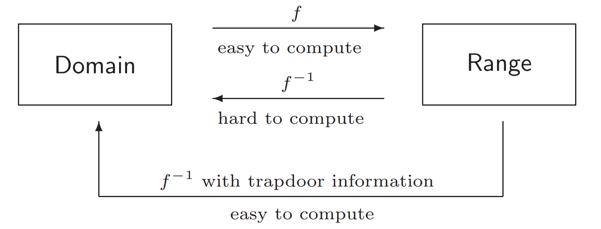
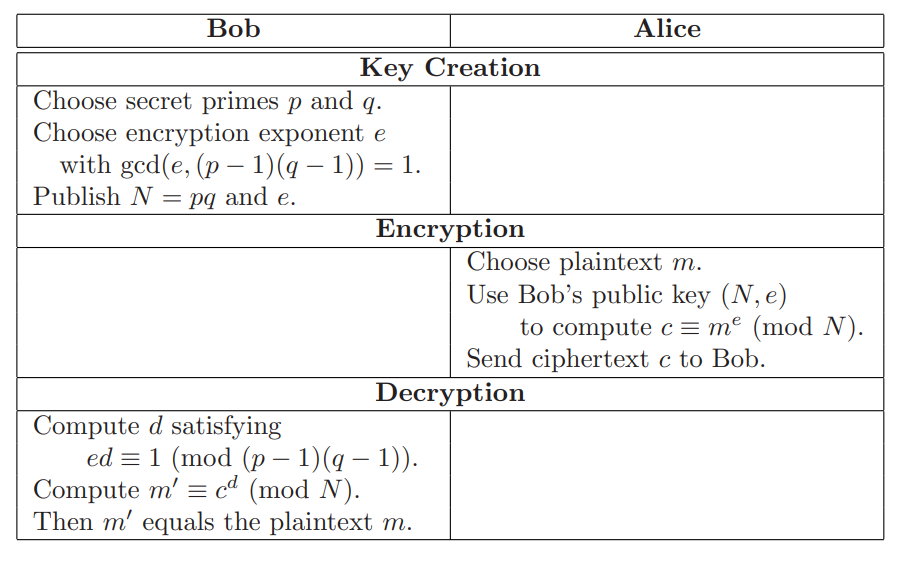
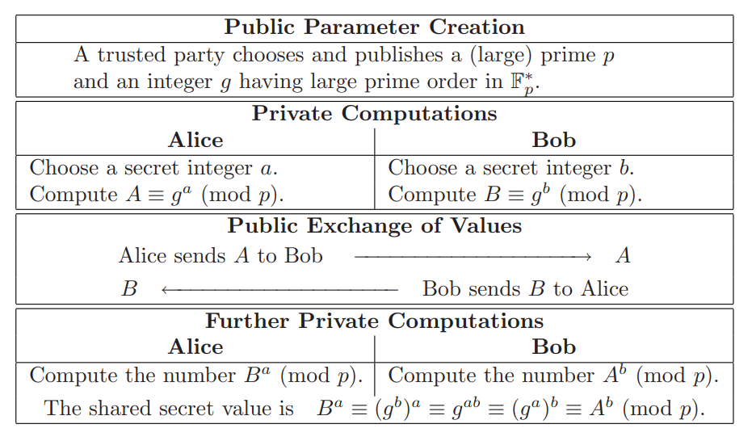
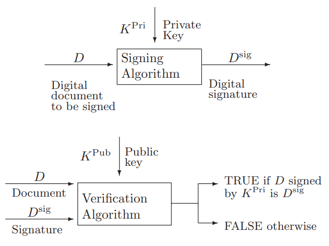

- Key 
- Encryption / decryption 
- Plaintext
- Ciphertext

# Encoding / Decoding
[CyberChef](https://gchq.github.io/CyberChef/)

# Scripting tools 

## Python
```python 
pip install pycryptodome 
```
## Sagemath
- [Installation guide](https://doc.sagemath.org/html/en/installation/index.html)
- [How to install SageMath in Ubuntu in 24.04](https://askubuntu.com/questions/1516582/how-to-install-sagemath-in-ubuntu-in-24-04)

# Classic Cipher 
## Xor

# Symmetric

## AES

[Demonstrasi AES](https://legacy.cryptool.org/en/cto/aes-animation)

### Mode Operasi AES

1. ECB (Electronic Codebook)
2. CBC (Cipher Block Chaining)
3. CTR (Counter)
4. GCM (Galois/Counter Mode)

Contoh Kode AES dalam Python:
```
from Crypto.Cipher import AES
from Crypto.Util.Padding import pad, unpad
from Crypto.Random import get_random_bytes
import base64

# Input
pt = 'Institut Teknologi Sepuluh Nopember'
key = 'kripto'  # Kunci harus 16, 24, atau 32 byte untuk AES-128, AES-192, atau AES-256

# Persiapan
key = key.encode('utf-8')
key = pad(key, AES.block_size)[:16]  # Menggunakan 16 byte (AES-128)
iv = get_random_bytes(AES.block_size)  # Inisialisasi vektor (IV) untuk CBC mode
print(f"Key (AES-128): {key}")
print(f"IV (AES-CBC): {iv}")

# Enkripsi
cipher = AES.new(key, AES.MODE_CBC, iv)
ct_bytes = cipher.encrypt(pad(pt.encode('utf-8'), AES.block_size))
ct = base64.b64encode(ct_bytes).decode('utf-8')
print(f"Ciphertext (AES-CBC): {ct}")

# Dekripsi
cipher = AES.new(key, AES.MODE_CBC, iv)
pt_bytes = unpad(cipher.decrypt(base64.b64decode(ct)), AES.block_size)
decrypted_pt = pt_bytes.decode('utf-8')
print(f"Decrypted: {decrypted_pt}")

```
output 
```
Ciphertext (AES-CBC): VC9zG1H04xLfWiWDz/msHCVgAZget4gMYNuruH/JLP8DVKxwz3adsdNVboJVD6Mi
Decrypted: Institut Teknologi Sepuluh Nopember

```

### Attack

## Insecure Symmetric Algorithms


# Asymmetric

public key

private key




## RSA



Contoh Kode RSA dalam Python:
- Encrypt 
```
from Crypto.Util.number import *

p = getPrime(512)
q = getPrime(512)
n = p * q
e = 65537
phi = (p - 1) * (q - 1)
d = inverse(e, phi)

pt = b'Institut Teknologi Sepuluh Nopember'
ct = pow(bytes_to_long(pt), e, n)

print(f'ct = {ct}')
print(f'n = {n}')
print(f'p = {p}')
```
- Decrypt 
```
from Crypto.Util.number import *

ct = 2699239613457833832720319517158496328470134291465773134777456583411772501634237421060887346951258659031869803309488933169388122467249769310112393785522007670386264941939811138618847649481890919836258086845065584152125071494958443655210217986493354658057047982149383792274022397140604728555795729471443192180
n = 97532442693426020435820245243615769950487854865514509293964937492395294555185912917273730437233598628522375021623965082852471492487603048718239595923067399653488267500227449425675931999549154696040946450722844055333727071135081720509117600088436334765340245825825846539009457498856214666252503616653849419553
p = 9462753695092080742767955795250011811763326630113098906390560441958387110467306519218110160533664538732944765260309462266418088428819775351221902548838873

def main():
    q = n // p
    e = 65537
    phi = (p - 1) * (q - 1)
    d = inverse(e, phi)
    pt = long_to_bytes(pow(ct, d, n))
    print(f'pt = {pt}')

if __name__ == '__main__':
    main()

```


Menggunakan library:

```python rsa.py
from Crypto.PublicKey import RSA
from Crypto.Cipher import PKCS1_OAEP
import binascii

keyPair = RSA.generate(3072)

pubKey = keyPair.publickey()
print(f"Public key:  (n={hex(pubKey.n)}, e={hex(pubKey.e)})")
pubKeyPEM = pubKey.exportKey()
print(pubKeyPEM.decode('ascii'))

print(f"Private key: (n={hex(pubKey.n)}, d={hex(keyPair.d)})")
privKeyPEM = keyPair.exportKey()
print(privKeyPEM.decode('ascii'))

msg = b'A message for encryption'
encryptor = PKCS1_OAEP.new(pubKey)
encrypted = encryptor.encrypt(msg)
print("Encrypted:", binascii.hexlify(encrypted))

decryptor = PKCS1_OAEP.new(keyPair)
decrypted = decryptor.decrypt(encrypted)
print('Decrypted:', decrypted)

```

### Attack

[Twenty Years of Attacks on the RSA Cryptosystem](https://crypto.stanford.edu/~dabo/papers/RSA-survey.pdf)

#### Implementation

- https://github.com/ashutosh1206/Crypton/tree/master/RSA-encryption
- https://github.com/jvdsn/crypto-attacks/tree/master/attacks/rsa

## Diffie–Hellman key exchange



Contoh Diffie-Hellman Key Exchange:
```python 
from cryptography.hazmat.primitives.asymmetric import dh
from cryptography.hazmat.primitives import serialization

# Membuat parameter Diffie-Hellman
parameters = dh.generate_parameters(generator=2, key_size=512)

# Membuat kunci untuk Alice dan Bob
alice_private_key = parameters.generate_private_key()
bob_private_key = parameters.generate_private_key()

# Pertukaran kunci publik (dalam praktik nyata, pertukaran ini melalui jaringan)
alice_public_key = alice_private_key.public_key()
bob_public_key = bob_private_key.public_key()

# Alice menghitung kunci rahasia bersama
alice_shared_key = alice_private_key.exchange(bob_public_key)
print(f"Alice's shared key: {alice_shared_key.hex()[:20]}...")

# Bob menghitung kunci rahasia bersama
bob_shared_key = bob_private_key.exchange(alice_public_key)
print(f"Bob's shared key: {bob_shared_key.hex()[:20]}...")

# Verifikasi bahwa keduanya mendapatkan kunci yang sama
print(f"Keys match: {alice_shared_key == bob_shared_key}")

```
Output 
```
Alice's shared key: 7dc4ba57b61f23d53f0a...
Bob's shared key: 7dc4ba57b61f23d53f0a...
Keys match: True
```

## Digital Signatures



## ECC

[Animated Elliptic Curve](https://curves.xargs.org/)

### ECDH

### ECDSA

### Attack
https://github.com/elikaski/ECC_Attacks/

## MAC and key derivation

## Hash Function

salting

hash password

### Collision
### Algoritma Hash Secure
### Algoritma Hash Insecure
### Hash Functions: Applications

Contoh code hash 
```python
import hashlib
import hmac

# Input
pt = 'Institut Teknologi Sepuluh Nopember'
key = 'kripto'

# MD5 (tidak aman untuk penggunaan kriptografis)
md5_hash = hashlib.md5(pt.encode()).hexdigest()
print(f"MD5: {md5_hash}")

# SHA-1 (tidak direkomendasikan untuk penggunaan baru)
sha1_hash = hashlib.sha1(pt.encode()).hexdigest()
print(f"SHA-1: {sha1_hash}")

# SHA-256 (direkomendasikan)
sha256_hash = hashlib.sha256(pt.encode()).hexdigest()
print(f"SHA-256: {sha256_hash}")

# SHA-512 (lebih kuat)
sha512_hash = hashlib.sha512(pt.encode()).hexdigest()
print(f"SHA-512: {sha512_hash}")

# Contoh salting
salt = "garam_rahasia"
salted_input = pt + salt
sha256_salted = hashlib.sha256(salted_input.encode()).hexdigest()
print(f"SHA-256 dengan salt: {sha256_salted}")

# HMAC (Hash-based Message Authentication Code)
hmac_sha256 = hmac.new(key.encode(), pt.encode(), hashlib.sha256).hexdigest()
print(f"HMAC-SHA256: {hmac_sha256}")
```
Output:
```
MD5: 9fee4eca8227fa5700eda3c75c66ea25
SHA-1: e85c3f1dde4b2fe8841181e33642952a5c73151c
SHA-256: dc56d4b16655b69592a47f07ddb4f708561b12560cae8e7d22b6178a3d144e15
SHA-512: 62dc1b435fd032c12e066ed717fa918e9ceabc63d20a59c851d8a92ccbd867948b1161...
SHA-256 dengan salt: c474513a67428e8aff17a51bcc2a923c4b9201825d55e709ce688cfcc054c61b
HMAC-SHA256: 6b65bf69bc6fb03e70c3c4f143470010faed5c0c8e2857c8f5dce40597babbe1
```
Contoh Verifikasi Integritas Data :
```python
def verify_data_integrity(data, stored_hash):
    """Verifikasi integritas data dengan membandingkan hash."""
    calculated_hash = hashlib.sha256(data.encode()).hexdigest()
    if calculated_hash == stored_hash:
        return True, "Data tidak berubah"
    else:
        return False, "Integritas data rusak"

# Data asli dan hash tersimpan
original_data = 'Institut Teknologi Sepuluh Nopember'
stored_hash = hashlib.sha256(original_data.encode()).hexdigest()

# Kasus 1: Data tidak berubah
test_data1 = 'Institut Teknologi Sepuluh Nopember'
result1, message1 = verify_data_integrity(test_data1, stored_hash)
print(f"Kasus 1: {message1}")

# Kasus 2: Data berubah
test_data2 = 'Institut Teknologi Sepuluh November'
result2, message2 = verify_data_integrity(test_data2, stored_hash)
print(f"Kasus 2: {message2}")

```
Output
```
Kasus 1: Data tidak berubah
Kasus 2: Integritas data rusak
```

### Hash Cracking

- Bruteforce Attack 
- Dictionary Attack 

misalnya menggunakan **rockyou.txt** di dalam kali linux.

selain itu ada dictionary lain diantaranya :
- [SecList](https://github.com/danielmiessler/SecLists)
- [Indonesian Wordlist](https://github.com/geovedi/indonesian-wordlist)
- etc

#### John the Ripper

John adalah command-line tool yang paling mudah digunakan dan ramah pemula untuk password cracking. Asumsikan kita memiliki file `hashes.txt` dengan konten sebagai berikut:

```
┌──(kali㉿kali)-[~/Documents/wiki]
└─$ cat hashes.txt 
MisterH:$2y$10$IT4k5kmSGvHSO9d6M/1w0eYiB5Ne9XzArQRFJTGThNiy/yBtkIj12
MyMom:$2a$12$SOn8Pf6z8fO/nVsNbAAequ/P6vLRJJl7gCUEiYBU2iLHn4G/p/Zw2
```
cara umum untuk crack password menggunakan john adalah seperti berikut, tanpa menspesifikasikan sebuah wordlist, john akan menggunakan dictionary defaultnya sendiri.
```
john <hash_file> 
```
untuk menggunakan dictionary khusus atau custom selain dictionary default john dapat dilakukan sebagai berikut
```
john <hash_file> --wordlist=/path/to/wordlist.txt
```
untuk menampilkan password dari hash yang berhasil di crack, dapat menggunakan perintah berikut
```
john --show <hash_file>
```
berikut contoh menggunakan file hash yang sebelumnya telah dicontohkan

```
┌──(kali㉿kali)-[~/Documents/wiki]
└─$ john hashes.txt --wordlist=/usr/share/wordlists/rockyou.txt
Using default input encoding: UTF-8
Loaded 2 password hashes with 2 different salts (bcrypt [Blowfish 32/64 X3])
Remaining 1 password hash
Cost 1 (iteration count) is 4096 for all loaded hashes
Will run 6 OpenMP threads
Press 'q' or Ctrl-C to abort, almost any other key for status
spongebob1       (MyMom)     
1g 0:00:00:25 DONE (2024-04-23 13:03) 0.03974g/s 53.65p/s 53.65c/s 53.65C/s winston..eunice
Use the "--show" option to display all of the cracked passwords reliably
Session completed.

┌──(kali㉿kali)-[~/Documents/wiki]
└─$ john --show hashes.txt                                     
MisterH:tequieromucho
MyMom:spongebob1

2 password hashes cracked, 0 left

```
gunakan `john -h` atau `man john` untuk detail lebih lanjut. Atau gunakan cheatsheet dibawah ini untuk kasus-kasus dimana john sering digunakan:

| Command | tldr;          |
| ------------- | --------------- |
|`john path/to/hashes.txt`|Crack password hashes|
|`john --show path/to/hashes.txt`|Show passwords cracked|
|`john --show --users=user_ids path/to/hashes1.txt path/to/hashes2.txt ...`|Display users' cracked passwords by user identifier from multiple files|
|`john --wordlist=path/to/wordlist.txt path/to/hashes.txt`|Crack password hashes, using a custom wordlist|
|`john --list=formats`|List available hash formats|
|`john --format=md5crypt path/to/hashes.txt	`|Crack password hashes, using a specific hash format|
|`john --rules path/to/hashes.txt`|Crack password hashes, enabling word mangling rules|
|`john --restore=path/to/mycrack.rec`|Restore an interrupted cracking session from a state file, e.g. mycrack.rec|

#### Hashcat

Hashcat adalah alternatif lain untuk tool cracking password. Hashcat sendiri menawarkan fitur yang lebih advanced

cara umum untuk crack password menggunakan Hashcat adalah seperti berikut

```
hashcat -a <attack mode> -m <hash type> <hash file> <wordlist>
```

`attack mode` adalah jenis serangan yang akan dipakai.

| #         | Mode          |
| ------------- | --------------- |
|0|Straight|
|1|Combination|
|3|Brute-force|
|6|Hybrid Wordlist + Mask|
|7|Hybrid Mask + Wordlist|
|9|Association|


`hash type` adalah jenis hash yang dicoba untuk di crack. tanpa menspesifikan hash type, Hashcat akan mencoba menentukan tipe hash secara otomatis, namun hal ini tidak akan selalu berhasil.

[Identify hash types](https://hashes.com/en/tools/hash_identifier)

Dalam contoh ini kita akan menggunakan jenis hash tipe NetNTLMv2 yang dipakai oleh Windows dan Active Directory.

```
┌──(kali㉿kali)-[~/Documents/wiki]
└─$ cat NetNTLMv2.txt   
Administrator::WIN-487IMQOIA8E:997b18cc61099ba2:3CC46296B0CCFC7A231D918AE1DAE521:0101000000000000B09B51939BA6D40140C54ED46AD58E890000000002000E004E004F004D00410054004300480001000A0053004D0042003100320004000A0053004D0042003100320003000A0053004D0042003100320005000A0053004D0042003100320008003000300000000000000000000000003000004289286EDA193B087E214F3E16E2BE88FEC5D9FF73197456C9A6861FF5B5D3330000000000000000
```
Berikut contoh penggunaan untuk hashcat untuk crash password diatas:
```
┌──(kali㉿kali)-[~/Documents/wiki]
└─$ hashcat -a 0 -m 5600 NetNTLMv2.txt /usr/share/wordlists/rockyou.txt 
hashcat (v6.2.6) starting

OpenCL API (OpenCL 3.0 PoCL 3.1+debian  Linux, None+Asserts, RELOC, SPIR, LLVM 15.0.6, SLEEF, DISTRO, POCL_DEBUG) - Platform #1 [The pocl project]
==================================================================================================================================================
* Device #1: pthread-sandybridge-AMD Ryzen 5 5600H with Radeon Graphics, 5613/11290 MB (2048 MB allocatable), 6MCU

Minimum password length supported by kernel: 0
Maximum password length supported by kernel: 256

Hashes: 1 digests; 1 unique digests, 1 unique salts
Bitmaps: 16 bits, 65536 entries, 0x0000ffff mask, 262144 bytes, 5/13 rotates
Rules: 1

Optimizers applied:
* Zero-Byte
* Not-Iterated
* Single-Hash
* Single-Salt

ATTENTION! Pure (unoptimized) backend kernels selected.
Pure kernels can crack longer passwords, but drastically reduce performance.
If you want to switch to optimized kernels, append -O to your commandline.
See the above message to find out about the exact limits.

Watchdog: Temperature abort trigger set to 90c

Host memory required for this attack: 1 MB

Dictionary cache hit:
* Filename..: /usr/share/wordlists/rockyou.txt
* Passwords.: 14344385
* Bytes.....: 139921507
* Keyspace..: 14344385

ADMINISTRATOR::WIN-487IMQOIA8E:997b18cc61099ba2:3cc46296b0ccfc7a231d918ae1dae521:0101000000000000b09b51939ba6d40140c54ed46ad58e890000000002000e004e004f004d00410054004300480001000a0053004d0042003100320004000a0053004d0042003100320003000a0053004d0042003100320005000a0053004d0042003100320008003000300000000000000000000000003000004289286eda193b087e214f3e16e2be88fec5d9ff73197456c9a6861ff5b5d3330000000000000000:P@ssword
                                                          
Session..........: hashcat
Status...........: Cracked
Hash.Mode........: 5600 (NetNTLMv2)
Hash.Target......: ADMINISTRATOR::WIN-487IMQOIA8E:997b18cc61099ba2:3cc...000000
Time.Started.....: Tue Apr 23 13:24:28 2024 (1 sec)
Time.Estimated...: Tue Apr 23 13:24:29 2024 (0 secs)
Kernel.Feature...: Pure Kernel
Guess.Base.......: File (/usr/share/wordlists/rockyou.txt)
Guess.Queue......: 1/1 (100.00%)
Speed.#1.........:  1686.5 kH/s (2.33ms) @ Accel:1024 Loops:1 Thr:1 Vec:8
Recovered........: 1/1 (100.00%) Digests (total), 1/1 (100.00%) Digests (new)
Progress.........: 79872/14344385 (0.56%)
Rejected.........: 0/79872 (0.00%)
Restore.Point....: 73728/14344385 (0.51%)
Restore.Sub.#1...: Salt:0 Amplifier:0-1 Iteration:0-1
Candidate.Engine.: Device Generator
Candidates.#1....: compu -> Bulldog
Hardware.Mon.#1..: Util: 21%

Started: Tue Apr 23 13:24:28 2024
Stopped: Tue Apr 23 13:24:31 2024

```

gunakan `hashcat -h` atau `man hashcat` untuk detail lebih lanjut. Atau gunakan cheatsheet dibawah ini untuk kasus-kasus dimana hashcat sering digunakan:

| Command         | tldr;          |
| ------------- | --------------- |
| `hashcat --hash-type hash_type_id --attack-mode 3 hash_value` | Perform a brute-force attack (mode 3) with the default hashcat mask    |
| `hashcat --hash-type hash_type_id --attack-mode 3 hash_value "?d?d?d?d"` | Perform a brute-force attack (mode 3) with a known pattern of 4 digits |
| `hashcat --hash-type hash_type_id --attack-mode 3 --increment hash_value "?a?a?a?a?a?a?a?a"` | Perform a brute-force attack (mode 3) using at most 8 of all printable ASCII characters |
| `hashcat --hash-type hash_type_id --attack-mode 0 hash_value /usr/share/wordlists/rockyou.txt	` | Perform a dictionary attack (mode 0) using the RockYou wordlist of a Kali Linux box |
| `hashcat --hash-type hash_type_id --attack-mode 0 --rules-file /usr/share/hashcat/rules/best64.rule hash_value /usr/share/wordlists/rockyou.txt` | Perform a rule-based dictionary attack (mode 0) using the RockYou wordlist mutated with common password variations |
| `hashcat --hash-type hash_type_id --attack-mode 1 hash_value /path/to/dictionary1.txt /path/to/dictionary2.txt` | Perform a combination attack (mode 1) using the concatenation of words from two different custom dictionaries |
| `hashcat --show hash_value` | Show result of an already cracked hash |
| `hashcat --example-hashes	` | Show all example hashes |

## Referensi

- [Practical Cryptography](https://cryptobook.nakov.com/)