Cryptography is the science of secret writing with the goal of hiding the meaning of a message.

# Encoding / Decoding

An encoding scheme is a method of converting one sort of data into another sort of data for example, converting text into numbers. Encoding and decoding function
are public knowledge and should be fast and easy to compute.

## ASCII
ASCII is a 7-bit encoding standard which allows the representation of text using the integers 0-127. see [ASCII Table](https://www.ascii-code.com/)

```
def encode_ascii(text: str):
    codes = [ord(c) for c in text]           # ASCII/Unicode code points
    return codes

def decode_ascii(codes: list[int]):
    return ''.join(chr(n) for n in codes)

if __name__ == "__main__":
    text = "institut teknologi sepuluh nopember"

    codes = encode_ascii(text)
    print("Original text:")
    print(text)
    print("\nASCII codes (decimal):")
    print(codes)

    restored = decode_ascii(codes)
    print("\nDecoded from codes:")
    print(restored)
```
Output
```
Original text:
institut teknologi sepuluh nopember

ASCII codes (decimal):
[105, 110, 115, 116, 105, 116, 117, 116, 32, 116, 101, 107, 110, 111, 108, 111, 103, 105, 32, 115, 101, 112, 117, 108, 117, 104, 32, 110, 111, 112, 101, 109, 98, 101, 114]

Decoded from codes:
institut teknologi sepuluh nopember
```

## Hex 

When we encrypt something the resulting ciphertext commonly has bytes which are not printable ASCII characters. If we want to share our encrypted data, it's common to encode it into something more user-friendly and portable across different systems.

Hexadecimal can be used in such a way to represent ASCII strings. First each letter is converted to an ordinal number according to the ASCII table (as in the previous challenge). Then the decimal numbers are converted to base-16 numbers, otherwise known as hexadecimal. The numbers can be combined together, into one long hex string.

```
def decode_hex(hex_string: str):
    return bytes.fromhex(hex_string).decode("ascii")

def encode_hex(text: str):
    return text.encode("ascii").hex()

if __name__ == "__main__":
    text = "institut teknologi sepuluh nopember"
    encoded_text = encode_hex(text)
    print("\nEncoded text to hex:")
    print(encoded_text)

    print("\nDecoded back:")
    print(decode_hex(encoded_text))
```
Output
```
Encoded text to hex:
696e7374697475742074656b6e6f6c6f676920736570756c7568206e6f70656d626572

Decoded back:
institut teknologi sepuluh nopember
```
## Base64

Another common encoding scheme is Base64, which allows us to represent binary data as an ASCII string using an alphabet of 64 characters. One character of a Base64 string encodes 6 binary digits (bits), and so 4 characters of Base64 encode three 8-bit bytes.

```
import base64

def b64_encode_text(text: str) -> str:
    return base64.b64encode(text.encode("utf-8")).decode("ascii")

def b64_decode_text(b64str: str) -> str:
    return base64.b64decode(b64str.encode("ascii")).decode("utf-8")

if __name__ == "__main__":

    txt = "institut teknologi sepuluh nopember"
    b64 = b64_encode_text(txt)
    print("\nEncode text -> Base64:")
    print(b64)

    print("\nDecode Base64 -> text:")
    print(b64_decode_text(b64))
```
Output
```
Encode text -> Base64:
aW5zdGl0dXQgdGVrbm9sb2dpIHNlcHVsdWggbm9wZW1iZXI=

Decode Base64 -> text:
institut teknologi sepuluh nopember
```

## Bytes and Big Integers

Cryptosystems  works on numbers, but messages are made up of characters.
The most common way is to take the ordinal bytes of the message, convert them into hexadecimal, and concatenate. This can be interpreted as a base-16/hexadecimal number, and also represented in base-10/decimal.
Python's PyCryptodome library implements this with the methods `bytes_to_long()` and `long_to_bytes()`.

```
from Crypto.Util.number import bytes_to_long, long_to_bytes

msg = b"institut teknologi sepuluh nopember"


# Convert bytes -> integer
m = bytes_to_long(msg)
print("Integer form:", m)

# Convert back integer -> bytes
print("Recovered message:", long_to_bytes(m))

```
Output
```
Integer form: 800071861804757451250108096703574388044617923339077042606193931454114973447908124018
Recovered message: b'institut teknologi sepuluh nopember'
```
Bisa juga menggunakan tools [CyberChef](https://gchq.github.io/CyberChef/) untuk berbagai macam encoding lainnya.

# Scripting tools 

## Python
```python 
pip install pycryptodome 
```
## Sagemath
- [Installation guide](https://doc.sagemath.org/html/en/installation/index.html)
- [How to install SageMath in Ubuntu in 24.04](https://askubuntu.com/questions/1516582/how-to-install-sagemath-in-ubuntu-in-24-04)

# Xor
XOR is a bitwise operator which returns 0 if the bits are the same, and 1 otherwise. In textbooks the XOR operator is denoted by ⊕, but in most challenges and programming languages you will see the caret `^` used instead.
<Note>
Xor properties
- Commutative: A ⊕ B = B ⊕ A
- Associative: A ⊕ (B ⊕ C) = (A ⊕ B) ⊕ C
- Identity: A ⊕ 0 = A
- Self-Inverse: A ⊕ A = 0
</Note>

Let's put this into practice! Below is a series of outputs where three random keys have been XOR'd together and with the flag. Use the above properties to undo the encryption in the final line to obtain the flag.
```
KEY1 = c94133d85deeb56c7d7693863708cacc95bda79a5561a48f8cfdd64c119f4242263ba7
KEY2 ^ KEY1 = a33ce5d8c29f99dcd7c997901d9f1cef62fea5b338318c43099896d8b99b384fa1424f
KEY2 ^ KEY3 = 130e347ddc61b9e934130643f69c7b7eb2c2a548078ec70d59f35cb08b642620145a54
FLAG ^ KEY1 ^ KEY3 ^ KEY2 = b32174d1e8fb79f16911f0aeaffbdddd401622a1379f16eea066aa92f58b010f500481
```
<Tip> Before you XOR these objects, be sure to decode from hex to bytes.</Tip>
Solver
```
k1  = bytes.fromhex("c94133d85deeb56c7d7693863708cacc95bda79a5561a48f8cfdd64c119f4242263ba7")
k21 = bytes.fromhex("a33ce5d8c29f99dcd7c997901d9f1cef62fea5b338318c43099896d8b99b384fa1424f")  # KEY2 ^ KEY1
k23 = bytes.fromhex("130e347ddc61b9e934130643f69c7b7eb2c2a548078ec70d59f35cb08b642620145a54")  # KEY2 ^ KEY3
f123= bytes.fromhex("b32174d1e8fb79f16911f0aeaffbdddd401622a1379f16eea066aa92f58b010f500481")  # FLAG ^ KEY1 ^ KEY3 ^ KEY2

bxor = lambda a,b: bytes(x ^ y for x,y in zip(a,b))

k2 = bxor(k1, k21)            # KEY2 = (KEY2 ^ KEY1) ^ KEY1
k3 = bxor(bxor(k21, k23), k1) # KEY3 = (KEY2^KEY1) ^ (KEY2^KEY3) ^ KEY1
flag = bxor(bxor(bxor(f123, k1), k3), k2)

print(flag.decode())  
```
Output
```
institut teknologi sepuluh nopember
```

# Symmetric

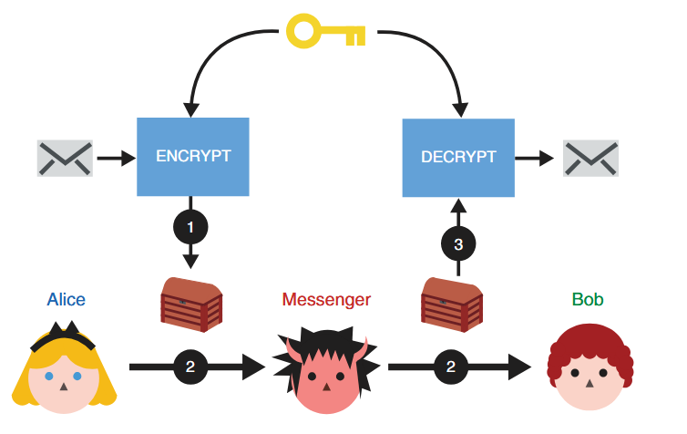
> (1) Alice uses the ENCRYPT function with a secret key to
transform her message into noise. (2) She then passes the encrypted message
to her messenger, who will not learn anything about the underlying message.
(3) Once Bob receives the encrypted message, he can recover the original
content by using the DECRYPT function with the same secret key Alice used.

## AES
The most famous symmetric-key cipher is Advanced Encryption Standard ([AES](https://en.wikipedia.org/wiki/Advanced_Encryption_Standard)), standardised in 2001. 

[Demonstrasi AES](https://legacy.cryptool.org/en/cto/aes-animation)

We can split symmetric-key ciphers into two types, block ciphers and stream ciphers. Block ciphers break up a plaintext into fixed-length blocks, and send each block through an encryption function together with a secret key. Stream ciphers meanwhile encrypt one byte of plaintext at a time, by XORing a pseudo-random keystream with the data. AES is a block cipher but can be turned into a stream cipher using modes of operation such as CTR.

Block ciphers only specify how to encrypt and decrypt individual blocks, and a mode of operation must be used to apply the cipher to longer messages.

### Mode Operasi AES

1. ECB (Electronic Codebook)
2. CBC (Cipher Block Chaining)
3. CTR (Counter)
4. GCM (Galois/Counter Mode)

more about [Mode operation](https://en.wikipedia.org/wiki/Block_cipher_mode_of_operation)

Contoh Kode AES dalam Python:
```
from Crypto.Cipher import AES
from Crypto.Util.Padding import pad, unpad
from Crypto.Random import get_random_bytes
import base64

# Input
pt = 'Institut Teknologi Sepuluh Nopember'
key = 'kripto'  # Kunci harus 16, 24, atau 32 byte untuk AES-128, AES-192, atau AES-256

# Persiapan
key = key.encode('utf-8')
key = pad(key, AES.block_size)[:16]  # Menggunakan 16 byte (AES-128)
iv = get_random_bytes(AES.block_size)  # Inisialisasi vektor (IV) untuk CBC mode
print(f"Key (AES-128): {key}")
print(f"IV (AES-CBC): {iv}")

# Enkripsi
cipher = AES.new(key, AES.MODE_CBC, iv)
ct_bytes = cipher.encrypt(pad(pt.encode('utf-8'), AES.block_size))
ct = base64.b64encode(ct_bytes).decode('utf-8')
print(f"Ciphertext (AES-CBC): {ct}")

# Dekripsi
cipher = AES.new(key, AES.MODE_CBC, iv)
pt_bytes = unpad(cipher.decrypt(base64.b64decode(ct)), AES.block_size)
decrypted_pt = pt_bytes.decode('utf-8')
print(f"Decrypted: {decrypted_pt}")

```
output 
```
Ciphertext (AES-CBC): VC9zG1H04xLfWiWDz/msHCVgAZget4gMYNuruH/JLP8DVKxwz3adsdNVboJVD6Mi
Decrypted: Institut Teknologi Sepuluh Nopember

```

### Attack
- https://github.com/jvdsn/crypto-attacks/tree/master/attacks
- https://github.com/ashutosh1206/Crypton/tree/master/Block-Ciphers
- https://book.jorianwoltjer.com/cryptography/aes
- https://github.com/Merricx/aes-attack

# Asymmetric

## Asymmetric encryption
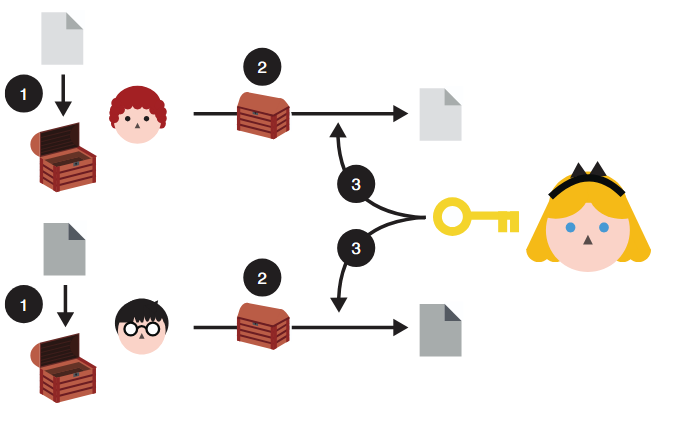
> To use asymmetric encryption, Queen Alice needs to first
publish her public key (represented as an open box here). Now, anyone
can use the public key to encrypt messages to her. And she should be
able to decrypt them using the associated private key.

> Asymmetric encryption: (1) anyone can use Queen Alice’s public
key to encrypt messages to her. (2) After receiving them, (3) she can decrypt
the content using her associated private key. Nobody is able to observe the
messages directed to Queen Alice while they are being sent to her.


Secure Asymetric encription are built using one-way functions that have a trapdoor. The
trapdoor is a piece of auxiliary information that allows the inverse to be easily
computed. A one-way function is an invertible function that is easy to compute, but whose inverse is difficult to
compute. 

### RSA

[visualization](https://legacy.cryptool.org/en/cto/rsa-visual)

Contoh Kode RSA dalam Python:
- Encrypt 
```
from Crypto.Util.number import *

p = getPrime(512)
q = getPrime(512)
n = p * q
e = 65537
phi = (p - 1) * (q - 1)
d = inverse(e, phi)

pt = b'Institut Teknologi Sepuluh Nopember'
ct = pow(bytes_to_long(pt), e, n)

print(f'ct = {ct}')
print(f'n = {n}')
print(f'p = {p}')
```
- Decrypt 
```
from Crypto.Util.number import *

ct = 2699239613457833832720319517158496328470134291465773134777456583411772501634237421060887346951258659031869803309488933169388122467249769310112393785522007670386264941939811138618847649481890919836258086845065584152125071494958443655210217986493354658057047982149383792274022397140604728555795729471443192180
n = 97532442693426020435820245243615769950487854865514509293964937492395294555185912917273730437233598628522375021623965082852471492487603048718239595923067399653488267500227449425675931999549154696040946450722844055333727071135081720509117600088436334765340245825825846539009457498856214666252503616653849419553
p = 9462753695092080742767955795250011811763326630113098906390560441958387110467306519218110160533664538732944765260309462266418088428819775351221902548838873

def main():
    q = n // p
    e = 65537
    phi = (p - 1) * (q - 1)
    d = inverse(e, phi)
    pt = long_to_bytes(pow(ct, d, n))
    print(f'pt = {pt}')

if __name__ == '__main__':
    main()

```


Menggunakan library:

```python rsa.py
from Crypto.PublicKey import RSA
from Crypto.Cipher import PKCS1_OAEP
import binascii

keyPair = RSA.generate(3072)

pubKey = keyPair.publickey()
print(f"Public key:  (n={hex(pubKey.n)}, e={hex(pubKey.e)})")
pubKeyPEM = pubKey.exportKey()
print(pubKeyPEM.decode('ascii'))

print(f"Private key: (n={hex(pubKey.n)}, d={hex(keyPair.d)})")
privKeyPEM = keyPair.exportKey()
print(privKeyPEM.decode('ascii'))

msg = b'A message for encryption'
encryptor = PKCS1_OAEP.new(pubKey)
encrypted = encryptor.encrypt(msg)
print("Encrypted:", binascii.hexlify(encrypted))

decryptor = PKCS1_OAEP.new(keyPair)
decrypted = decryptor.decrypt(encrypted)
print('Decrypted:', decrypted)

```

#### Attack

[Twenty Years of Attacks on the RSA Cryptosystem](https://crypto.stanford.edu/~dabo/papers/RSA-survey.pdf)

Implementation

- https://github.com/ashutosh1206/Crypton/tree/master/RSA-encryption
- https://github.com/jvdsn/crypto-attacks/tree/master/attacks/rsa

## Diffie–Hellman key exchange

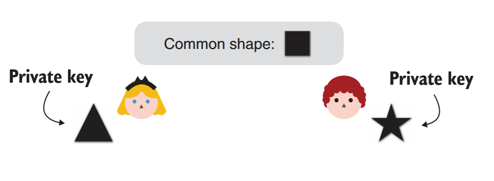
> in our analogy, Queen
Alice chooses a triangle as her private
key, whereas Lord Bob chooses a star
as his private key.


> The second step of
a DH key exchange where both
participants exchange their
public keys. Participants derive
their public keys by combining
their private keys with a
common shape.

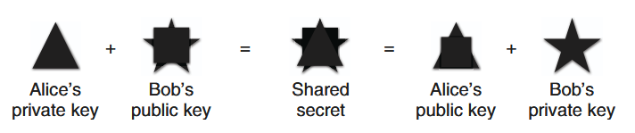
> The final step of a DH key exchange where both participants
produce the same shared secret. To do this, Queen Alice combines her
private key with Lord Bob’s public key, and Lord Bob combines his private
key with Queen Alice’s public key. The shared secret cannot be obtained
from solely observing the public keys

Mathematical Formulation of the Diffie–Hellman Key Exchange Protocol


Contoh Code Diffie-Hellman Key Exchange:
```python 
from cryptography.hazmat.primitives.asymmetric import dh
from cryptography.hazmat.primitives import serialization

# Membuat parameter Diffie-Hellman
parameters = dh.generate_parameters(generator=2, key_size=512)

# Membuat kunci untuk Alice dan Bob
alice_private_key = parameters.generate_private_key()
bob_private_key = parameters.generate_private_key()

# Pertukaran kunci publik (dalam praktik nyata, pertukaran ini melalui jaringan)
alice_public_key = alice_private_key.public_key()
bob_public_key = bob_private_key.public_key()

# Alice menghitung kunci rahasia bersama
alice_shared_key = alice_private_key.exchange(bob_public_key)
print(f"Alice's shared key: {alice_shared_key.hex()[:20]}...")

# Bob menghitung kunci rahasia bersama
bob_shared_key = bob_private_key.exchange(alice_public_key)
print(f"Bob's shared key: {bob_shared_key.hex()[:20]}...")

# Verifikasi bahwa keduanya mendapatkan kunci yang sama
print(f"Keys match: {alice_shared_key == bob_shared_key}")

```
Output 
```
Alice's shared key: 7dc4ba57b61f23d53f0a...
Bob's shared key: 7dc4ba57b61f23d53f0a...
Keys match: True
```

### Man In The Middle

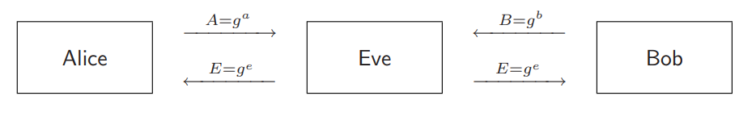

## Digital Signatures

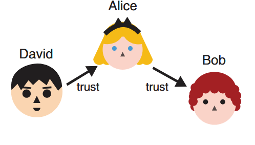
> Lord David already trusts
Queen Alice. Because Queen Alice trusts
Lord Bob, can Lord David safely trust Lord
Bob as well?

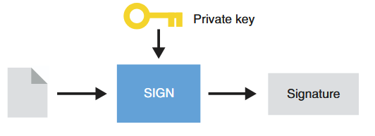
> To sign a message, Queen
Alice uses her private key and generates
a signature.

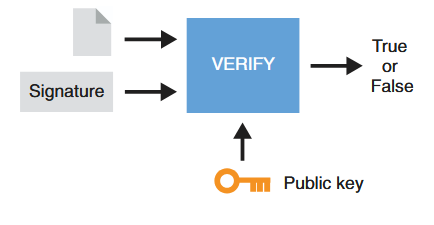
> To verify a signature from
Queen Alice, one also needs the message
signed and Queen Alice’s public key. The
result is either validating the signature or
invalidating it.


# Hybrid

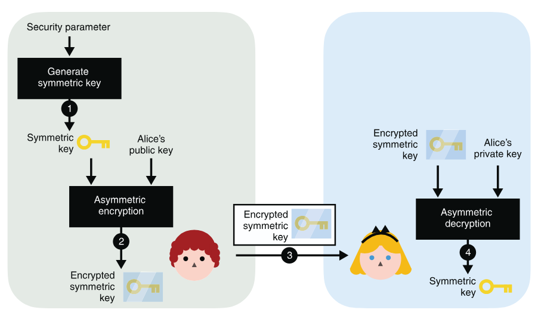
> To use asymmetric encryption as a key exchange primitive, you can (1) generate a
symmetric key and (2) encrypt it with Alice’s public key. After (3) sending it to Alice, she can (4) decrypt
it with her associated private key. At the end of the protocol, you both have the shared secret, while no
one else is able to derive it from observing the encrypted symmetric key alone.

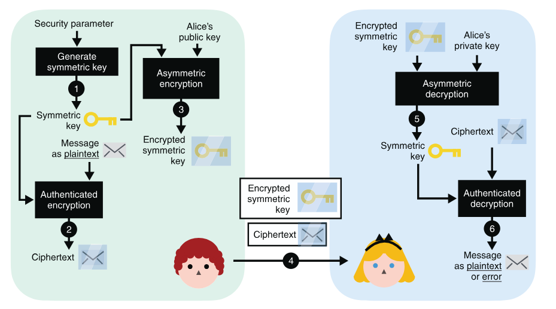
> (4) after you send both the encrypted symmetric key and the encrypted
message to Alice, (5) Alice decrypts the symmetric key using her private key. (6) She then uses the symmetric
key to decrypt the encrypted message. (Note that steps 5 and 6 can both fail and return errors if the
communications are tampered with by a MITM attacker at step 4.)


# Hash Function
In cryptography, hash functions transform input data of arbitrary size (e.g. a text message) to a result of fixed size (e.g. 256 bits), which is called hash value (or hash code, message digest, or simply hash). 

## Security properties of a hash function
- pre-image resistance
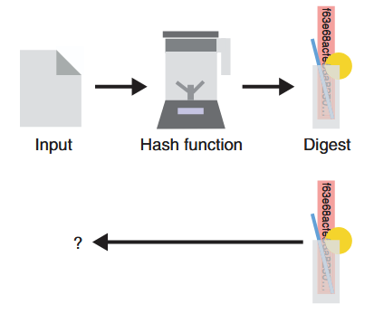
> Given the digest produced by a hash
function (represented as a blender here), it is impossible
(or technically so hard we assume it will never happen)
to reverse it and find the original input used. This
security property is called pre-image resistance.
- second pre-image resistance
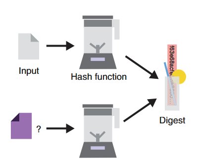
> Considering an input and its associated
digest, one should never be able to find a different
input that hashes to the same output. This security
property is called second pre-image resistance.
- collision resistance
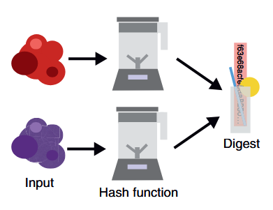
> One should never be able to find two inputs
(represented on the left as two random blobs of data)
that hash to the same output value (on the right). This
security property is called collision resistance

Play with most popular cryptographic hash functions online: https://www.fileformat.info/tool/hash.htm.

## Secure Hash Algorithms
- [SHA-2](https://en.wikipedia.org/wiki/SHA-2) is a family of strong cryptographic hash functions: SHA-256 (256 bits hash), SHA-384 (384 bits hash), SHA-512 (512 bits hash), etc. 
- [SHA-3](https://en.wikipedia.org/wiki/SHA-3) (and its variants SHA3-224, SHA3-256, SHA3-384, SHA3-512), is considered more secure than SHA-2 for the same hash length.
- Keccak-256, which is used in the Ethereum blockchain, is a variant of SHA3-256 with some constants changed in the code.
- BLAKE2 / BLAKE2s / BLAKE2b .BLAKE is one of the finalists at the [SHA-3 NIST competition](https://en.wikipedia.org/wiki/NIST_hash_function_competition#Finalists). The BLAKE2 hash function has similar security strength like SHA-3, but is less used by developers than SHA2 and SHA3.
- [RIPEMD-160](https://en.wikipedia.org/wiki/RIPEMD) is a secure hash function, widely used in cryptography, e.g. in PGP and Bitcoin.SHA-2 and SHA-3 are more stronger than RIPEMD, due to higher bit length and less chance for collisions.

## Other Secure Hash Functions
alternatives to SHA-2, SHA-3 and BLAKE2:
- [Whirlpool](https://en.wikipedia.org/wiki/Whirlpool_(hash_function))
- SM3 is the crypto hash function, officialy standartized by the Chinese government. It is similar to SHA-256 and produces 256-bit hashes.
- [GOST](https://en.wikipedia.org/wiki/GOST_(hash_function)) (GOST R 34.11-94) is secure cryptographic hash function, the Russian national standard, described in RFC 4357

finalists at the SHA-3 NIST competition:
[Skein](https://en.wikipedia.org/wiki/Skein_(hash_function)), [Grøstl](https://en.wikipedia.org/wiki/Gr%C3%B8stl), and [JH](https://en.wikipedia.org/wiki/JH_%28hash_function)

## Insecure Hash Algorithms

[SHA0](https://en.wikipedia.org/wiki/SHA-1#SHA-0), [SHA1](https://en.wikipedia.org/wiki/SHA-1), [MD2](https://en.wikipedia.org/wiki/MD2_%28hash_function), [MD4](https://en.wikipedia.org/wiki/MD4), [MD5](https://en.wikipedia.org/wiki/MD5), [Panama](https://en.wikipedia.org/wiki/Panama_%28cryptography), [HAVAL](https://en.wikipedia.org/wiki/HAVAL), [Tiger](https://en.wikipedia.org/wiki/Tiger_%28hash_function), and [SipHash](https://en.wikipedia.org/wiki/SipHash).

## Attack
### Length-extension Attack
[length extension attack](https://en.wikipedia.org/wiki/Length_extension_attack) is a type of attack where an attacker can use Hash(message1) and the length of message1 to calculate Hash(message1 ‖ message2) for an attacker-controlled message2, without needing to know the content of message1.

[Implementation](https://github.com/zademn/EverythingCrypto/blob/master/S3-Message-Integrity/Length_Extension_attacks.ipynb)

tools:
- https://github.com/thecrabsterchief/hash-length-extension
- https://github.com/stephenbradshaw/hlextend
### Birthday Attack/mitm
A [birthday attack](https://en.wikipedia.org/wiki/Birthday_attack) is a bruteforce collision attack that exploits the mathematics behind the birthday problem in probability theory.

[Implementation](https://github.com/zademn/EverythingCrypto/blob/master/S3-Message-Integrity/Birhtday_attack.ipynb)

tools:
- https://github.com/cr-marcstevens/hashclash
- https://github.com/corkami/collisions

### Password Cracking
Password cracking (also called password hacking) is an attack vector that involves hackers attempting to crack or determine a password for unauthorized authentication.

Pada modul ini kita akan melakukan jenis serangan Dictionary Attack. Dictionary Attack akan mencoba meng-hash baris per baris dalam wordlist dan akan membandingkannya dengan hash yang telah dibocorkan. Apabila hashnya sama maka password sebenarnya telah ditemukan.

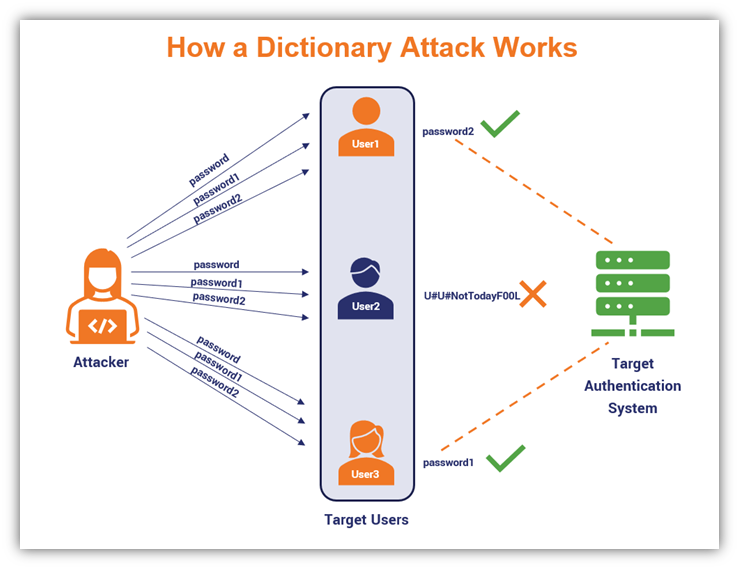

misalnya menggunakan **rockyou.txt** di dalam kali linux.

selain itu ada dictionary lain diantaranya :
- [SecList](https://github.com/danielmiessler/SecLists)
- [Indonesian Wordlist](https://github.com/geovedi/indonesian-wordlist)
- etc

#### John the Ripper

John adalah command-line tool yang paling mudah digunakan dan ramah pemula untuk password cracking. Asumsikan kita memiliki file `hashes.txt` dengan konten sebagai berikut:

```
┌──(kali㉿kali)-[~/Documents/wiki]
└─$ cat hashes.txt 
MisterH:$2y$10$IT4k5kmSGvHSO9d6M/1w0eYiB5Ne9XzArQRFJTGThNiy/yBtkIj12
MyMom:$2a$12$SOn8Pf6z8fO/nVsNbAAequ/P6vLRJJl7gCUEiYBU2iLHn4G/p/Zw2
```
cara umum untuk crack password menggunakan john adalah seperti berikut, tanpa menspesifikasikan sebuah wordlist, john akan menggunakan dictionary defaultnya sendiri.
```
john <hash_file> 
```
untuk menggunakan dictionary khusus atau custom selain dictionary default john dapat dilakukan sebagai berikut
```
john <hash_file> --wordlist=/path/to/wordlist.txt
```
untuk menampilkan password dari hash yang berhasil di crack, dapat menggunakan perintah berikut
```
john --show <hash_file>
```
berikut contoh menggunakan file hash yang sebelumnya telah dicontohkan

```
┌──(kali㉿kali)-[~/Documents/wiki]
└─$ john hashes.txt --wordlist=/usr/share/wordlists/rockyou.txt
Using default input encoding: UTF-8
Loaded 2 password hashes with 2 different salts (bcrypt [Blowfish 32/64 X3])
Remaining 1 password hash
Cost 1 (iteration count) is 4096 for all loaded hashes
Will run 6 OpenMP threads
Press 'q' or Ctrl-C to abort, almost any other key for status
spongebob1       (MyMom)     
1g 0:00:00:25 DONE (2024-04-23 13:03) 0.03974g/s 53.65p/s 53.65c/s 53.65C/s winston..eunice
Use the "--show" option to display all of the cracked passwords reliably
Session completed.

┌──(kali㉿kali)-[~/Documents/wiki]
└─$ john --show hashes.txt                                     
MisterH:tequieromucho
MyMom:spongebob1

2 password hashes cracked, 0 left

```
gunakan `john -h` atau `man john` untuk detail lebih lanjut. Atau gunakan cheatsheet dibawah ini untuk kasus-kasus dimana john sering digunakan:

| Command | tldr;          |
| ------------- | --------------- |
|`john path/to/hashes.txt`|Crack password hashes|
|`john --show path/to/hashes.txt`|Show passwords cracked|
|`john --show --users=user_ids path/to/hashes1.txt path/to/hashes2.txt ...`|Display users' cracked passwords by user identifier from multiple files|
|`john --wordlist=path/to/wordlist.txt path/to/hashes.txt`|Crack password hashes, using a custom wordlist|
|`john --list=formats`|List available hash formats|
|`john --format=md5crypt path/to/hashes.txt	`|Crack password hashes, using a specific hash format|
|`john --rules path/to/hashes.txt`|Crack password hashes, enabling word mangling rules|
|`john --restore=path/to/mycrack.rec`|Restore an interrupted cracking session from a state file, e.g. mycrack.rec|

#### Hashcat

Hashcat adalah alternatif lain untuk tool cracking password. Hashcat sendiri menawarkan fitur yang lebih advanced

cara umum untuk crack password menggunakan Hashcat adalah seperti berikut

```
hashcat -a <attack mode> -m <hash type> <hash file> <wordlist>
```

`attack mode` adalah jenis serangan yang akan dipakai.

| #         | Mode          |
| ------------- | --------------- |
|0|Straight|
|1|Combination|
|3|Brute-force|
|6|Hybrid Wordlist + Mask|
|7|Hybrid Mask + Wordlist|
|9|Association|


`hash type` adalah jenis hash yang dicoba untuk di crack. tanpa menspesifikan hash type, Hashcat akan mencoba menentukan tipe hash secara otomatis, namun hal ini tidak akan selalu berhasil.

[Identify hash types](https://hashes.com/en/tools/hash_identifier)

Dalam contoh ini kita akan menggunakan jenis hash tipe NetNTLMv2 yang dipakai oleh Windows dan Active Directory.

```
┌──(kali㉿kali)-[~/Documents/wiki]
└─$ cat NetNTLMv2.txt   
Administrator::WIN-487IMQOIA8E:997b18cc61099ba2:3CC46296B0CCFC7A231D918AE1DAE521:0101000000000000B09B51939BA6D40140C54ED46AD58E890000000002000E004E004F004D00410054004300480001000A0053004D0042003100320004000A0053004D0042003100320003000A0053004D0042003100320005000A0053004D0042003100320008003000300000000000000000000000003000004289286EDA193B087E214F3E16E2BE88FEC5D9FF73197456C9A6861FF5B5D3330000000000000000
```
Berikut contoh penggunaan untuk hashcat untuk crash password diatas:
```
┌──(kali㉿kali)-[~/Documents/wiki]
└─$ hashcat -a 0 -m 5600 NetNTLMv2.txt /usr/share/wordlists/rockyou.txt 
hashcat (v6.2.6) starting

OpenCL API (OpenCL 3.0 PoCL 3.1+debian  Linux, None+Asserts, RELOC, SPIR, LLVM 15.0.6, SLEEF, DISTRO, POCL_DEBUG) - Platform #1 [The pocl project]
==================================================================================================================================================
* Device #1: pthread-sandybridge-AMD Ryzen 5 5600H with Radeon Graphics, 5613/11290 MB (2048 MB allocatable), 6MCU

Minimum password length supported by kernel: 0
Maximum password length supported by kernel: 256

Hashes: 1 digests; 1 unique digests, 1 unique salts
Bitmaps: 16 bits, 65536 entries, 0x0000ffff mask, 262144 bytes, 5/13 rotates
Rules: 1

Optimizers applied:
* Zero-Byte
* Not-Iterated
* Single-Hash
* Single-Salt

ATTENTION! Pure (unoptimized) backend kernels selected.
Pure kernels can crack longer passwords, but drastically reduce performance.
If you want to switch to optimized kernels, append -O to your commandline.
See the above message to find out about the exact limits.

Watchdog: Temperature abort trigger set to 90c

Host memory required for this attack: 1 MB

Dictionary cache hit:
* Filename..: /usr/share/wordlists/rockyou.txt
* Passwords.: 14344385
* Bytes.....: 139921507
* Keyspace..: 14344385

ADMINISTRATOR::WIN-487IMQOIA8E:997b18cc61099ba2:3cc46296b0ccfc7a231d918ae1dae521:0101000000000000b09b51939ba6d40140c54ed46ad58e890000000002000e004e004f004d00410054004300480001000a0053004d0042003100320004000a0053004d0042003100320003000a0053004d0042003100320005000a0053004d0042003100320008003000300000000000000000000000003000004289286eda193b087e214f3e16e2be88fec5d9ff73197456c9a6861ff5b5d3330000000000000000:P@ssword
                                                          
Session..........: hashcat
Status...........: Cracked
Hash.Mode........: 5600 (NetNTLMv2)
Hash.Target......: ADMINISTRATOR::WIN-487IMQOIA8E:997b18cc61099ba2:3cc...000000
Time.Started.....: Tue Apr 23 13:24:28 2024 (1 sec)
Time.Estimated...: Tue Apr 23 13:24:29 2024 (0 secs)
Kernel.Feature...: Pure Kernel
Guess.Base.......: File (/usr/share/wordlists/rockyou.txt)
Guess.Queue......: 1/1 (100.00%)
Speed.#1.........:  1686.5 kH/s (2.33ms) @ Accel:1024 Loops:1 Thr:1 Vec:8
Recovered........: 1/1 (100.00%) Digests (total), 1/1 (100.00%) Digests (new)
Progress.........: 79872/14344385 (0.56%)
Rejected.........: 0/79872 (0.00%)
Restore.Point....: 73728/14344385 (0.51%)
Restore.Sub.#1...: Salt:0 Amplifier:0-1 Iteration:0-1
Candidate.Engine.: Device Generator
Candidates.#1....: compu -> Bulldog
Hardware.Mon.#1..: Util: 21%

Started: Tue Apr 23 13:24:28 2024
Stopped: Tue Apr 23 13:24:31 2024

```

gunakan `hashcat -h` atau `man hashcat` untuk detail lebih lanjut. Atau gunakan cheatsheet dibawah ini untuk kasus-kasus dimana hashcat sering digunakan:

| Command         | tldr;          |
| ------------- | --------------- |
| `hashcat --hash-type hash_type_id --attack-mode 3 hash_value` | Perform a brute-force attack (mode 3) with the default hashcat mask    |
| `hashcat --hash-type hash_type_id --attack-mode 3 hash_value "?d?d?d?d"` | Perform a brute-force attack (mode 3) with a known pattern of 4 digits |
| `hashcat --hash-type hash_type_id --attack-mode 3 --increment hash_value "?a?a?a?a?a?a?a?a"` | Perform a brute-force attack (mode 3) using at most 8 of all printable ASCII characters |
| `hashcat --hash-type hash_type_id --attack-mode 0 hash_value /usr/share/wordlists/rockyou.txt	` | Perform a dictionary attack (mode 0) using the RockYou wordlist of a Kali Linux box |
| `hashcat --hash-type hash_type_id --attack-mode 0 --rules-file /usr/share/hashcat/rules/best64.rule hash_value /usr/share/wordlists/rockyou.txt` | Perform a rule-based dictionary attack (mode 0) using the RockYou wordlist mutated with common password variations |
| `hashcat --hash-type hash_type_id --attack-mode 1 hash_value /path/to/dictionary1.txt /path/to/dictionary2.txt` | Perform a combination attack (mode 1) using the concatenation of words from two different custom dictionaries |
| `hashcat --show hash_value` | Show result of an already cracked hash |
| `hashcat --example-hashes	` | Show all example hashes |

# Referensi

- [Practical Cryptography](https://cryptobook.nakov.com/)
- [Real-World Cryptography](https://digitallibrary.peninsulacollege.edu.my/items/cefe8084-680c-4bb6-818d-d8e9e96d0fa7)